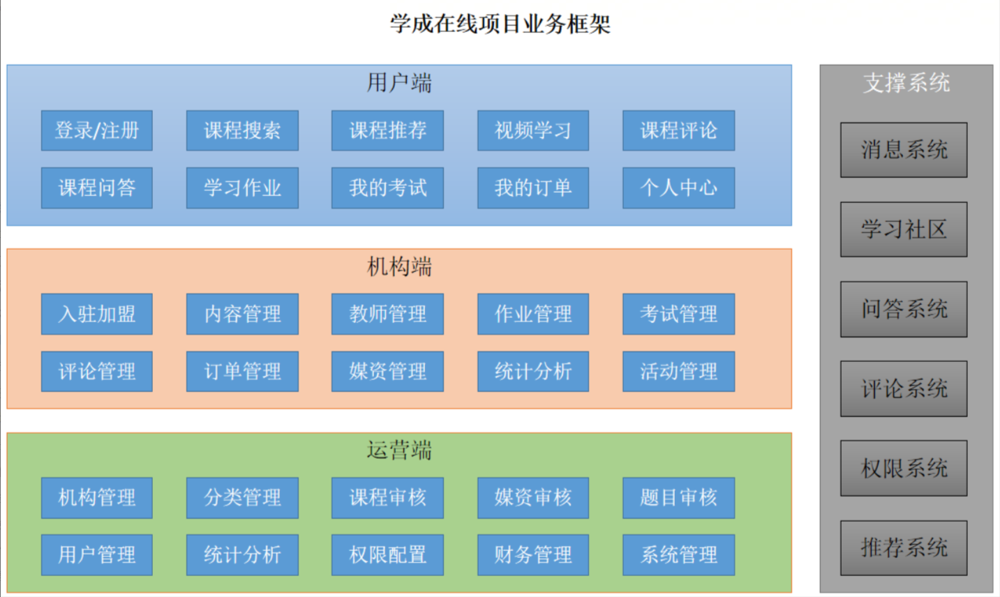
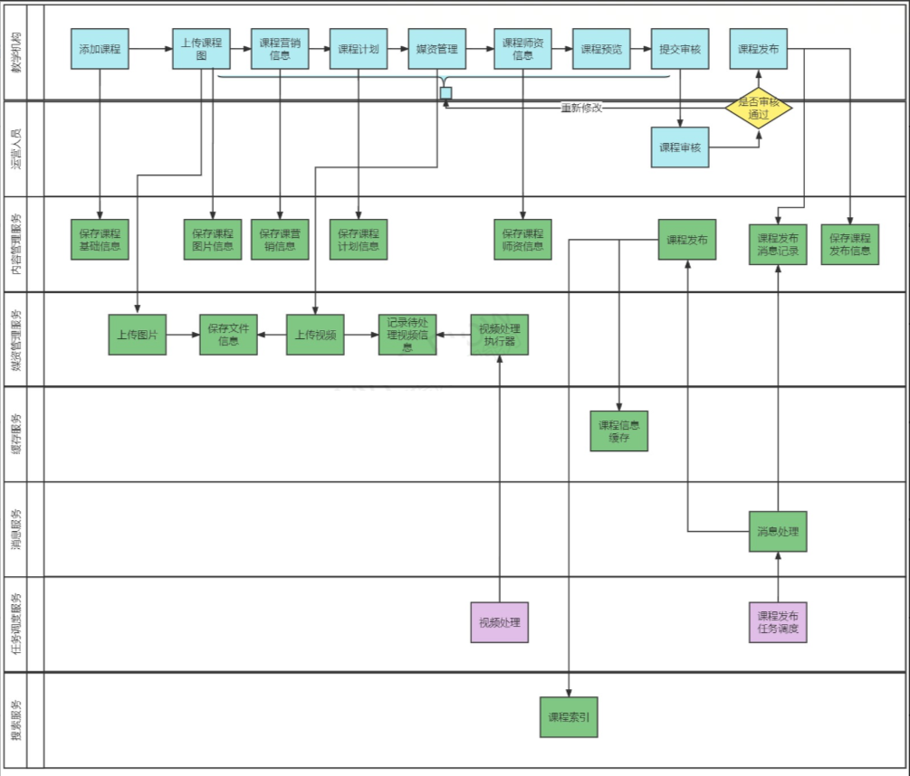
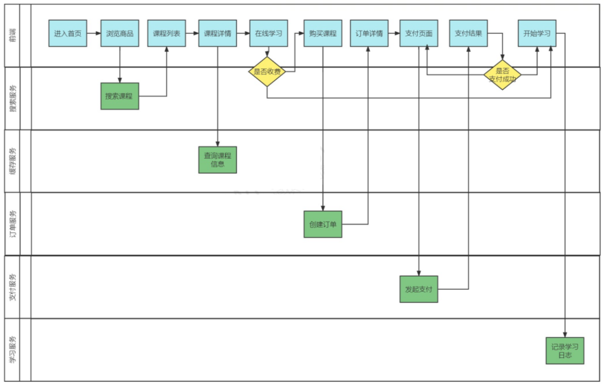
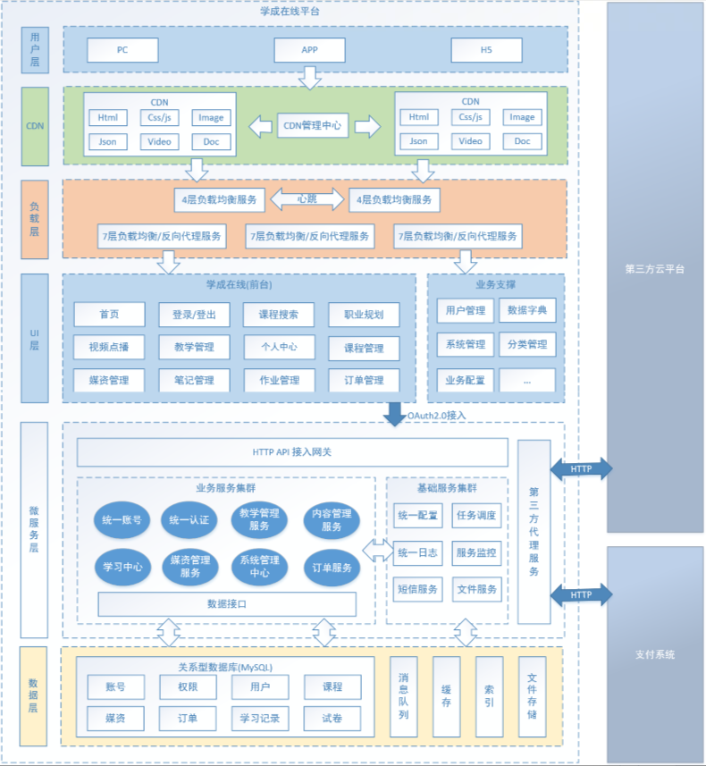
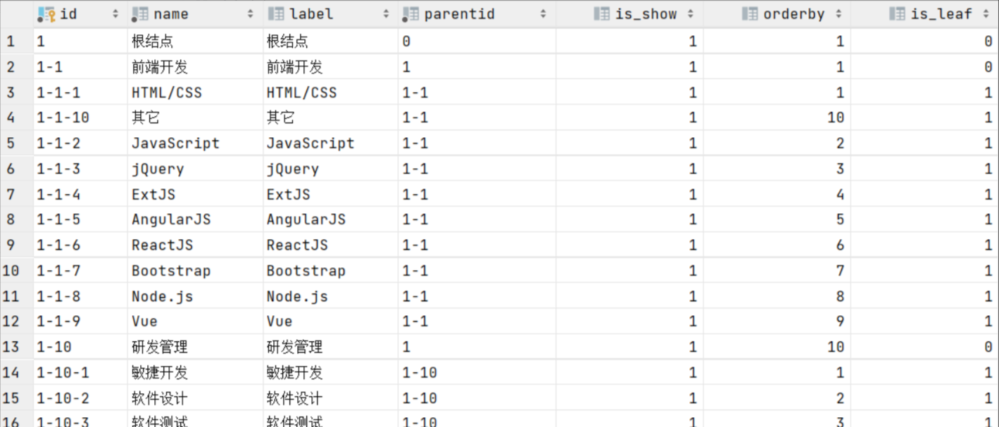

视频跳转：[《学成在线》](bilibili.com/video/BV1j8411N7Bm/?p=1)<br>
资料学习：[《学成在线讲义》](https://mx67xggunk5.feishu.cn/wiki/Y39iwM0mJidfeWkDmKJcp8uPn4f)<br>


# 项目介绍

这是传智教育·黑马所开发的Java课程项目《学成在线》，课程以在线教育业务为基础(有学员学习端和教学机构上传课程端)，
基于当前热门的Spring Cloud微服务技术栈进行设计，采用Nginx、SpringBoot、Spring Cloud、MyBatis-Plus、MQ、
Redis、Elasticsearch等框架和中间件为基础进行开发。<br>

## 项目业务介绍

本项目包括了用户端、机构端、运营端。<br>
核心模块包括:内容管理、媒资管理、课程搜索、订单支付、选课管理、认证授权等<br>
下图是项目的功能模块图:<br>
<div align=center>
<br>
</div>

下边介绍业务流程:<br>
1、课程编辑与发布流程如下:<br>
<div align=center>
<br>
</div>

2、课程发布后学生登录平台进行选课、在线学习。<br>
免费课程可直接学习，收费课程需要下单购买。<br>
学生选课流程如下<br>
<div align=center>
<br>
</div>

## 项目技术架构

本项目采用前后端分离架构，后端采用SpringBoot、SpringCloud技术栈开发，数据库使用了MySQL，
还使用的Redis、消息队列、分布式文件系统、Elasticsearch等中间件系统。划分的微服务包括:内容管理服务、
媒资管理服务、搜索服务、订单支付服务、学习中心服务、系统管理服务、认证授权服务、网关服务、注册中心服务、
配置中心服务等。下图是项目的技术架构图:<br>
<div align=center>
<br>
</div>

各层职责各层职责说明如下:<br>

| 名称   | 功能描述 |
|:-----|:-----|
| 用户层  | 用户层描述了本系统所支持的用户类型包括:pc用户、app用户、h5用户。pc用户通过浏览器访问系统、app用户通过android、ios手机访问系统，H5用户通过h5页面访问系统。   |
| CDN  | CDN全称Content Delivery Network，即内容分发网络，本系统所有静态资源全部通过CDN加速来提高访问速度。系统静态资源包括:html页面、js文件、css文件、image图片、pdf和ppt及doc教学文档、video视频等。   |
| 负载均衡 | 系统的CDN层、UI层、服务层及数据层均设置了负载均衡服务，上图仅在UI层前边标注了负载均衡。每一层的负载均衡会根据系统的需求来确定负载均衡器的类型系统支持4层负载均衡+7层负载均衡结合的方式，4层负载均衡是指在网络传输层进行流程转发，根据IP和端口进行转发，7层负载均衡完成HTTP协议负载均衡及反向代理的功能，根据url进行请求转发。   |
| UI层  | UI层描述了系统向pc用户、app用户、h5用户提供的产品界面。根据系统功能模块特点确定了UI层包括如下产品界面类型:1)面向pc用户的门户系统、学习中心系统、教学管理系统、系统管理中心。2)面向h5用户的门户系统、学习中心系统。3)面向app用户的门户系统、学习中心系统。   |
| 微服务层 | 微服务层将系统服务分类三类:业务服务、基础服务、第三方代理服务。业务服务主要为学成在线核心业务提供服务，并与数据层进行交互获得数据。基础服务主要管理学成在线系统运行所需的配置、日志、任务调度、短信等系统级别的服务。第三方代理服务:系统接入第三方服务完成业务的对接，例如认证、支付、视频点播/直播、用户认证和授权。   |
| 数据层  | 数据层描述了系统的数据存储的内容类型，关系性数据库:持久化的业务数据使用MySQL。消息队列:存储系统服务间通信的消息，本身提供消息存取服务，与微服务层的系统服务连接。 索引库:存储课程信息的索引信息，本身提供索引维护及搜索的服务，与微服务层的系统服务连接。缓存:作为系统的缓存服务，作为微服务的缓存数据便于查询。 文件存储:提供系统静态资源文件的分布式存储服务，文件存储服务器作为CDN服务器的数据来源，CDN上的静态资源将最终在文件存储服务器上保存多份。   |


# 模块技术总结

## 内容管理模块

内容管理系统（content management system，CMS），是一种位于WEB前端（Web 服务器）和后端办公系统或流程
（内容创作、编辑）之间的软件系统。内容的创作人员、编辑人员、发布人员使用内容管理系统来提交、修改、审批、发布内容。
这里指的“内容”可能包括文件、表格、图片、数据库中的数据甚至视频等一切你想要发布到Internet、Intranet以及
Extranet网站的信息。<br>
本项目作为一个大型的在线教育平台，其内容管理模块主要对课程及相关内容进行管理，包括：课程的基本信息、课程图片、
课程师资信息、课程的授课计划、课程视频、课程文档等内容的管理。<br>


### 课程分页查询
control-api层开发：<br>
```java
 @ApiOperation("课程查询接口--pageParams是分页参数，queryCourseParams--是查询条件，比如课程名、课程状态等等")
 @PostMapping("/course/list")
 public PageResult<CourseBase> list(PageParams pageParams, @RequestBody QueryCourseParamsDto queryCourseParams){
     PageResult<CourseBase> pageResult = courseBaseInfoService.queryCourseBaseList(pageParams, queryCourseParams);
    return pageResult;
 }
```
service层开发：
```java
@Service
public class CourseBaseInfoServiceImpl  implements CourseBaseInfoService {
    
    @Autowired
    CourseBaseMapper courseBaseMapper;

    @Override
    public PageResult<CourseBase> queryCourseBaseList(PageParams pageParams, QueryCourseParamsDto queryCourseParamsDto) {
        //构建查询条件对象
        LambdaQueryWrapper<CourseBase> queryWrapper = new LambdaQueryWrapper<>();
        //构建查询条件
        ......
        
        //分页对象
        Page<CourseBase> page = new Page<>(pageParams.getPageNo(), pageParams.getPageSize());
        // 查询数据内容获得结果
        Page<CourseBase> pageResult = courseBaseMapper.selectPage(page, queryWrapper);
        // 获取数据列表
        List<CourseBase> list = pageResult.getRecords();
        // 获取数据总数
        long total = pageResult.getTotal();
        // 构建结果集
        PageResult<CourseBase> courseBasePageResult = new PageResult<>(list, total, pageParams.getPageNo(), pageParams.getPageSize());
        return courseBasePageResult;
    }
}
```

### 课程查询
课程分类表是一个树型结构，其中parentid字段为父结点ID，它是树型结构的标志字段。
如果树的层级固定可以使用表的自链接去查询，比如：我们只查询两级课程分类，可以用下边的SQL:
```java
select
       one.id            one_id,
       one.name          one_name,
       one.parentid      one_parentid,
       one.orderby       one_orderby,
       one.label         one_label,
       two.id            two_id,
       two.name          two_name,
       two.parentid      two_parentid,
       two.orderby       two_orderby,
       two.label         two_label
   from course_category one
            inner join course_category two on one.id = two.parentid
   where one.parentid = 1
     and one.is_show = 1
     and two.is_show = 1
   order by one.orderby, two.orderby
```
如果树的层级不确定，此时可以使用MySQL递归实现，使用with语法，如下：
```java
    WITH [RECURSIVE]
        cte_name [(col_name [, col_name] ...)] AS (subquery)
        [, cte_name [(col_name [, col_name] ...)] AS (subquery)] ...
```
下边我们使用递归实现课程分类的查询:
```java
with recursive t1 as (
select * from  course_category p where  id= '1'
union all
 select t.* from course_category t inner join t1 on t1.id = t.parentid
)
select *  from t1 order by t1.id, t1.orderby
```
查询结果如下：
<div align=center>
<br>
</div>


