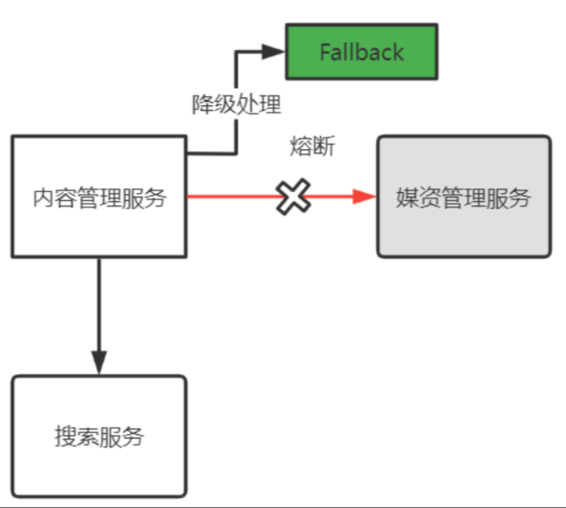

视频跳转：[《学成在线》](bilibili.com/video/BV1j8411N7Bm/?p=1)<br>
资料学习：[《学成在线讲义》](https://mx67xggunk5.feishu.cn/wiki/Y39iwM0mJidfeWkDmKJcp8uPn4f)<br>


# 项目介绍

这是传智教育·黑马所开发的Java课程项目《学成在线》，课程以在线教育业务为基础(有学员学习端和教学机构上传课程端)，
基于当前热门的Spring Cloud微服务技术栈进行设计，采用Nginx、SpringBoot、Spring Cloud、MyBatis-Plus、MQ、
Redis、Elasticsearch等框架和中间件为基础进行开发。<br>

## 项目业务介绍

本项目包括了用户端、机构端、运营端。<br>
核心模块包括:内容管理、媒资管理、课程搜索、订单支付、选课管理、认证授权等<br>
下图是项目的功能模块图:<br>
<div align=center>
<br>
</div>

下边介绍业务流程:<br>
1、课程编辑与发布流程如下:<br>
<div align=center>
<br>
</div>

2、课程发布后学生登录平台进行选课、在线学习。<br>
免费课程可直接学习，收费课程需要下单购买。<br>
学生选课流程如下<br>
<div align=center>
<br>
</div>

## 项目技术架构

本项目采用前后端分离架构，后端采用SpringBoot、SpringCloud技术栈开发，数据库使用了MySQL，
还使用的Redis、消息队列、分布式文件系统、Elasticsearch等中间件系统。划分的微服务包括:内容管理服务、
媒资管理服务、搜索服务、订单支付服务、学习中心服务、系统管理服务、认证授权服务、网关服务、注册中心服务、
配置中心服务等。下图是项目的技术架构图:<br>
<div align=center>
<br>
</div>

各层职责各层职责说明如下:<br>

| 名称   | 功能描述 |
|:-----|:-----|
| 用户层  | 用户层描述了本系统所支持的用户类型包括:pc用户、app用户、h5用户。pc用户通过浏览器访问系统、app用户通过android、ios手机访问系统，H5用户通过h5页面访问系统。   |
| CDN  | CDN全称Content Delivery Network，即内容分发网络，本系统所有静态资源全部通过CDN加速来提高访问速度。系统静态资源包括:html页面、js文件、css文件、image图片、pdf和ppt及doc教学文档、video视频等。   |
| 负载均衡 | 系统的CDN层、UI层、服务层及数据层均设置了负载均衡服务，上图仅在UI层前边标注了负载均衡。每一层的负载均衡会根据系统的需求来确定负载均衡器的类型系统支持4层负载均衡+7层负载均衡结合的方式，4层负载均衡是指在网络传输层进行流程转发，根据IP和端口进行转发，7层负载均衡完成HTTP协议负载均衡及反向代理的功能，根据url进行请求转发。   |
| UI层  | UI层描述了系统向pc用户、app用户、h5用户提供的产品界面。根据系统功能模块特点确定了UI层包括如下产品界面类型:1)面向pc用户的门户系统、学习中心系统、教学管理系统、系统管理中心。2)面向h5用户的门户系统、学习中心系统。3)面向app用户的门户系统、学习中心系统。   |
| 微服务层 | 微服务层将系统服务分类三类:业务服务、基础服务、第三方代理服务。业务服务主要为学成在线核心业务提供服务，并与数据层进行交互获得数据。基础服务主要管理学成在线系统运行所需的配置、日志、任务调度、短信等系统级别的服务。第三方代理服务:系统接入第三方服务完成业务的对接，例如认证、支付、视频点播/直播、用户认证和授权。   |
| 数据层  | 数据层描述了系统的数据存储的内容类型，关系性数据库:持久化的业务数据使用MySQL。消息队列:存储系统服务间通信的消息，本身提供消息存取服务，与微服务层的系统服务连接。 索引库:存储课程信息的索引信息，本身提供索引维护及搜索的服务，与微服务层的系统服务连接。缓存:作为系统的缓存服务，作为微服务的缓存数据便于查询。 文件存储:提供系统静态资源文件的分布式存储服务，文件存储服务器作为CDN服务器的数据来源，CDN上的静态资源将最终在文件存储服务器上保存多份。   |


# 重点模块技术总结

## 内容管理模块

内容管理系统（content management system，CMS），是一种位于WEB前端（Web 服务器）和后端办公系统或流程
（内容创作、编辑）之间的软件系统。内容的创作人员、编辑人员、发布人员使用内容管理系统来提交、修改、审批、发布内容。
这里指的“内容”可能包括文件、表格、图片、数据库中的数据甚至视频等一切你想要发布到Internet、Intranet以及
Extranet网站的信息。<br>
本项目作为一个大型的在线教育平台，其内容管理模块主要对课程及相关内容进行管理，包括：课程的基本信息、课程图片、
课程师资信息、课程的授课计划、课程视频、课程文档等内容的管理。<br>


### 课程分页查询
control-api层开发：<br>
```java
 @ApiOperation("课程查询接口--pageParams是分页参数，queryCourseParams--是查询条件，比如课程名、课程状态等等")
 @PostMapping("/course/list")
 public PageResult<CourseBase> list(PageParams pageParams, @RequestBody QueryCourseParamsDto queryCourseParams){
     PageResult<CourseBase> pageResult = courseBaseInfoService.queryCourseBaseList(pageParams, queryCourseParams);
    return pageResult;
 }
```
service层开发：
```java
@Service
public class CourseBaseInfoServiceImpl  implements CourseBaseInfoService {
    
    @Autowired
    CourseBaseMapper courseBaseMapper;

    @Override
    public PageResult<CourseBase> queryCourseBaseList(PageParams pageParams, QueryCourseParamsDto queryCourseParamsDto) {
        //构建查询条件对象
        LambdaQueryWrapper<CourseBase> queryWrapper = new LambdaQueryWrapper<>();
        //构建查询条件
        ......
        
        //分页对象
        Page<CourseBase> page = new Page<>(pageParams.getPageNo(), pageParams.getPageSize());
        // 查询数据内容获得结果
        Page<CourseBase> pageResult = courseBaseMapper.selectPage(page, queryWrapper);
        // 获取数据列表
        List<CourseBase> list = pageResult.getRecords();
        // 获取数据总数
        long total = pageResult.getTotal();
        // 构建结果集
        PageResult<CourseBase> courseBasePageResult = new PageResult<>(list, total, pageParams.getPageNo(), pageParams.getPageSize());
        return courseBasePageResult;
    }
}
```

### 课程查询
课程分类表是一个树型结构，其中parentid字段为父结点ID，它是树型结构的标志字段。
如果树的层级固定可以使用表的自链接去查询，比如：我们只查询两级课程分类，可以用下边的SQL:
```java
select
       one.id            one_id,
       one.name          one_name,
       one.parentid      one_parentid,
       one.orderby       one_orderby,
       one.label         one_label,
       two.id            two_id,
       two.name          two_name,
       two.parentid      two_parentid,
       two.orderby       two_orderby,
       two.label         two_label
   from course_category one
            inner join course_category two on one.id = two.parentid
   where one.parentid = 1
     and one.is_show = 1
     and two.is_show = 1
   order by one.orderby, two.orderby
```
如果树的层级不确定，此时可以使用MySQL递归实现，使用with语法，如下：
```java
    WITH [RECURSIVE]
        cte_name [(col_name [, col_name] ...)] AS (subquery)
        [, cte_name [(col_name [, col_name] ...)] AS (subquery)] ...
```
下边我们使用递归实现课程分类的查询:
```java
with recursive t1 as (
select * from  course_category p where  id= '1'
union all
 select t.* from course_category t inner join t1 on t1.id = t.parentid
)
select *  from t1 order by t1.id, t1.orderby
```
查询结果如下：
<div align=center>
<br>
</div>


### 统一异常处理

异常处理除了输出在日志中，还需要提示给用户，前端和后端需要作一些约定：<br>
1、错误提示信息统一以json格式返回给前端。<br>
2、以HTTP状态码决定当前是否出错，非200为操作异常。<br>
如何规范异常信息？<br>
代码中统一抛出项目的自定义异常类型，这样可以统一去捕获这一类或几类的异常。<br>
规范了异常类型就可以去获取异常信息。<br>
如果捕获了非项目自定义的异常类型统一向用户提示“执行过程异常，请重试”的错误信息。<br>
如何捕获异常？<br>
代码统一用try/catch方式去捕获代码比较臃肿，可以通过SpringMVC提供的控制器增强类统一由一个类去完成异常的捕获。<br>
如下图：<br>
<div align=center>
<br>
</div>

#### 定义一些通用的异常信息

```java
/**
 * @description 通用错误信息
 * @author Mr.M
 * @date 2022/9/6 11:29
 * @version 1.0
 */
public enum CommonError {

   UNKOWN_ERROR("执行过程异常，请重试。"),
   PARAMS_ERROR("非法参数"),
   OBJECT_NULL("对象为空"),
   QUERY_NULL("查询结果为空"),
   REQUEST_NULL("请求参数为空");

   private String errMessage;

   public String getErrMessage() {
      return errMessage;
   }

   private CommonError( String errMessage) {
      this.errMessage = errMessage;
   }
}
```

#### 自定义异常类型

```java
/**
 * @description 学成在线项目异常类
 * @author Mr.M
 * @date 2022/9/6 11:29
 * @version 1.0
 */
public class XueChengPlusException extends RuntimeException {

   private String errMessage;

   public XueChengPlusException() {
      super();
   }

   public XueChengPlusException(String errMessage) {
      super(errMessage);
      this.errMessage = errMessage;
   }

   public String getErrMessage() {
      return errMessage;
   }

   public static void cast(CommonError commonError){
       throw new XueChengPlusException(commonError.getErrMessage());
   }
   //这个用的比较多
   public static void cast(String errMessage){
       throw new XueChengPlusException(errMessage);
   }
}
```

#### 响应用户的统一类型
```java
import java.io.Serializable;

/**
 * 错误响应参数包装,响应给前端
 */
public class RestErrorResponse implements Serializable {

    private String errMessage;

    public RestErrorResponse(String errMessage){
        this.errMessage= errMessage;
    }

    public String getErrMessage() {
        return errMessage;
    }

    public void setErrMessage(String errMessage) {
        this.errMessage = errMessage;
    }
}
```

#### 全局异常处理器

从Spring 3.0-Spring 3.2版本之间，对Spring架构和SpringMVC的Controller的异常捕获提供了相应的异常处理。
- @ExceptionHandler
- Spring3.0提供的标识在方法上或类上的注解，用来表明方法的处理异常类型。
- @ControllerAdvice
- Spring3.2提供的新注解，从名字上可以看出大体意思是控制器增强，在项目中来增强SpringMVC中的Controller。通常和@ExceptionHandler结合使用，来处理SpringMVC的异常信息。
- @ResponseStatus
- Spring3.0提供的标识在方法上或类上的注解，用状态代码和应返回的原因标记方法或异常类。
  调用处理程序方法时，状态代码将应用于HTTP响应。

```java
/**
 * @description 全局异常处理器
 * @author Mr.M
 * @date 2022/9/6 11:29
 * @version 1.0
 */
@Slf4j
@ControllerAdvice
public class GlobalExceptionHandler {
   @ResponseBody
   @ExceptionHandler(XueChengPlusException.class)
   @ResponseStatus(HttpStatus.INTERNAL_SERVER_ERROR)
   //响应自定义的异常，自己写相关的错误，方便debug
   public RestErrorResponse customException(XueChengPlusException e) {
      log.error("【系统异常】{}",e.getErrMessage(),e);
      return new RestErrorResponse(e.getErrMessage());

   }

   @ResponseBody
   @ExceptionHandler(Exception.class)
   @ResponseStatus(HttpStatus.INTERNAL_SERVER_ERROR)
   //未知错误，统一响应
   public RestErrorResponse exception(Exception e) {
      log.error("【系统异常】{}",e.getMessage(),e);
      return new RestErrorResponse(CommonError.UNKOWN_ERROR.getErrMessage());
   }
}
```

### JSR303校验
前端请求后端接口传输参数，是在controller中校验还是在Service中校验？<br>
答案是都需要校验，只是分工不同。<br>
Contoller中校验请求参数的合法性，包括：必填项校验，数据格式校验，比如：是否是符合一定的日期格式等。<br>
Service中要校验的是业务规则相关的内容，比如：课程已经审核通过所以提交失败。<br>
Service中根据业务规则去校验不方便写成通用代码，Controller中则可以将校验的代码写成通用代码。<br>
SpringBoot提供了JSR-303的支持，它就是spring-boot-starter-validation，它的底层使用Hibernate Validator，Hibernate Validator是Bean Validation的参考实现。<br>
所以，在Controller层使用spring-boot-starter-validation完成对请求参数的基本合法性进行校验。<br>
假如一个接口使用AddCourseDto模型对象接收参数，所以进入AddCourseDto类，在属性上添加校验规则：<br>
```java
/**
 * @description 添加课程dto
 * @author Mr.M
 * @date 2022/9/7 17:40
 * @version 1.0
 */
@Data
@ApiModel(value="AddCourseDto", description="新增课程基本信息")
public class AddCourseDto {

 @NotEmpty(message = "课程名称不能为空")
 @ApiModelProperty(value = "课程名称", required = true)
 private String name;

 @NotEmpty(message = "适用人群不能为空")
 @Size(message = "适用人群内容过少",min = 10)
 @ApiModelProperty(value = "适用人群", required = true)
 private String users;

 @ApiModelProperty(value = "课程标签")
 private String tags;

 @NotEmpty(message = "课程分类不能为空")
 @ApiModelProperty(value = "大分类", required = true)
 private String mt;

 @NotEmpty(message = "课程分类不能为空")
 @ApiModelProperty(value = "小分类", required = true)
 private String st;

 @NotEmpty(message = "课程等级不能为空")
 @ApiModelProperty(value = "课程等级", required = true)
 private String grade;

 @ApiModelProperty(value = "教学模式（普通，录播，直播等）", required = true)
 private String teachmode;

 @ApiModelProperty(value = "课程介绍")
 private String description;

 @ApiModelProperty(value = "课程图片", required = true)
 private String pic;

 @NotEmpty(message = "收费规则不能为空")
 @ApiModelProperty(value = "收费规则，对应数据字典", required = true)
 private String charge;

 @ApiModelProperty(value = "价格")
 private BigDecimal price;

}
```
校验规则如下：
<div align=center>
<br>
</div>

定义好校验规则还需要开启校验，在controller方法中添加@Validated注解，如下：<br>
```java
@ApiOperation("新增课程基础信息")
@PostMapping("/course")
public CourseBaseInfoDto createCourseBase(@RequestBody @Validated AddCourseDto addCourseDto){
    //机构id，由于认证系统没有上线暂时硬编码
    Long companyId = 1L;
  return courseBaseInfoService.createCourseBase(companyId,addCourseDto);
}
```


## 媒资管理模块

媒体资源管理(Media Asset Management，MAM)系统是建立在多媒体、网络、数据库和数字存储等先进技术基础上的
一个对各种媒体及内容(如视/音频资料、文本文件、图表等)进行数字化存储、管理以及应用的总体解决方案，包括数字
媒体的采集、编目、管理、传输和编码转换等所有环节。其主要是满足媒体资源拥有者收集、保存、查找、编辑、发布各
种信息的要求，为媒体资源的使用者提供访问内容的便捷方法，实现对媒体资源的高效管理，大幅度提高媒体资源的价值。<br>
每个教学机构都可以在媒资系统管理自己的教学资源，包括：视频、教案等文件。<br>
目前媒资管理的主要管理对象是视频、图片、文档等，包括：媒资文件的查询、文件上传、视频处理等。<br>
媒资查询：教学机构查询自己所拥有的媒资信息。<br>

### 网关和Nacos
为什么所有的请求先到网关呢？<br>
有了网关就可以对请求进行路由，路由到具体的微服务，减少外界对接微服务的成本，比如：400电话，
路由的试可以根据请求路径进行路由、根据host地址进行路由等， 当微服务有多个实例时可以通过负载均衡算法进行路由，
如下：<br>

<div align=center>
<br>
</div>

另外，网关还可以实现权限控制、限流等功能。<br>
项目采用Spring Cloud Gateway作为网关，网关在请求路由时需要知道每个微服务实例的地址，
项目使用Nacos作用服务发现中心和配置中心，整体的架构图如下：<br>

<div align=center>
<br>
</div>

流程如下：<br>
1、微服务启动，将自己注册到Nacos，Nacos记录了各微服务实例的地址。<br>
2、网关从Nacos读取服务列表，包括服务名称、服务地址等。<br>
3、请求到达网关，网关将请求路由到具体的微服务。<br>
要使用网关首先搭建Nacos，Nacos有两个作用：<br>
1、服务发现中心<br>
微服务将自身注册至Nacos，网关从Nacos获取微服务列表。<br>
2、配置中心<br>
微服务众多，它们的配置信息也非常复杂，为了提供系统的可维护性，微服务的配置信息统一在Nacos配置。<br>


### 分布式文件系统

文件系统是负责管理和存储文件的系统软件，操作系统通过文件系统提供的接口去存取文件，用户通过操作系统访问磁盘上的文件。<br>
通过概念可以简单理解为：一个计算机无法存储海量的文件，通过网络将若干计算机组织起来共同去存储海量的文件，
去接收海量用户的请求，这些组织起来的计算机通过网络进行通信，如下图：

<div align=center>
<br>
</div>

好处：<br>
1、一台计算机的文件系统处理能力扩充到多台计算机同时处理。<br>
2、一台计算机挂了还有另外副本计算机提供数据。<br>
3、每台计算机可以放在不同的地域，这样用户就可以就近访问，提高访问速度。<br>

#### MinIO

本项目采用MinIO构建分布式文件系统，MinIO 是一个非常轻量的服务,可以很简单的和其他应用的结合使用，
它兼容亚马逊 S3 云存储服务接口，非常适合于存储大容量非结构化的数据，例如图片、视频、日志文件、
备份数据和容器/虚拟机镜像等。<br>
它一大特点就是轻量，使用简单，功能强大，支持各种平台，单个文件最大5TB，兼容Amazon S3接口，
提供了Java、Python、GO等多版本SDK支持。<br>

##### 上传文件测试
```java
/**
 * @description 测试MinIO
 * @author Mr.M
 * @date 2022/9/11 21:24
 * @version 1.0
 */
public class MinioTest {

    static MinioClient minioClient =
            MinioClient.builder()
                    .endpoint("http://192.168.101.65:9000")
                    .credentials("minioadmin", "minioadmin")
                    .build();

   //上传文件
   @Test
   public void upload() {
     //根据扩展名取出mimeType
     ContentInfo extensionMatch = ContentInfoUtil.findExtensionMatch(".mp4");
     String mimeType = MediaType.APPLICATION_OCTET_STREAM_VALUE;//通用mimeType，字节流
     if(extensionMatch!=null){
       mimeType = extensionMatch.getMimeType();
     }
     try {
       UploadObjectArgs testbucket = UploadObjectArgs.builder()
               .bucket("testbucket")
               .object("001/test001.mp4")//添加子目录
               .filename("D:\\develop\\upload\\1mp4.temp")
               .contentType(mimeType)//默认根据扩展名确定文件内容类型，也可以指定
               .build();
       minioClient.uploadObject(testbucket);
       System.out.println("上传成功");
     } catch (Exception e) {
       e.printStackTrace();
       System.out.println("上传失败");
     }

   }
}
```

##### 删除文件测试
```java
@Test
public void delete(){
    try {
        minioClient.removeObject(
               RemoveObjectArgs.builder().bucket("testbucket").object("001/test001.mp4").build());
        System.out.println("删除成功");
    } catch (Exception e) {
       e.printStackTrace();
        System.out.println("删除失败");
    }
}
```
校验文件的完整性，对文件计算出md5值，比较原始文件的md5和目标文件的md5，一致则说明完整:<br>
```java
//校验文件的完整性对文件的内容进行md5
FileInputStream fileInputStream1 = new FileInputStream(new File("D:\\develop\\upload\\1.mp4"));
String source_md5 = DigestUtils.md5Hex(fileInputStream1);
FileInputStream fileInputStream = new FileInputStream(new File("D:\\develop\\upload\\1a.mp4"));
String local_md5 = DigestUtils.md5Hex(fileInputStream);
if(source_md5.equals(local_md5)){
    System.out.println("下载成功");
}
```


### Service事务优化
方法上已经添加了@Transactional注解为什么该方法不能被事务控制呢？<br>
现在的问题其实是一个非事务方法调同类一个事务方法，事务无法控制，这是为什么？<br>
如果在方法上添加@Transactional注解，代理对象执行此方法前会开启事务, 如果在方法上没有@Transactional注解，
代理对象执行此方法前不进行事务控制, 不会进行事务控制是因为并不是通过代理对象执行的方法。<br>
如何解决呢？通过代理对象去调用方法即可解决。<br>
在MediaFileService的实现类中注入MediaFileService的代理对象，就是自己注入自己，如下：<br>
```java
@Autowired
MediaFileService currentProxy;

.....
//写入文件表
MediaFiles mediaFiles = currentProxy.addMediaFilesToDb(companyId, fileMd5, uploadFileParamsDto, bucket_files, objectName);
 ....
```


### 分布式任务调度-XXL-JOB
XXL-JOB是一个轻量级分布式任务调度平台，其核心设计目标是开发迅速、学习简单、轻量级、易扩展。
现已开放源代码并接入多家公司线上产品线，开箱即用。<br>

<div align=center>
<br>
</div>

调度中心：<br>
- 负责管理调度信息，按照调度配置发出调度请求，自身不承担业务代码；<br>
- 主要职责为执行器管理、任务管理、监控运维、日志管理等<br>
- 
任务执行器：<br>
- 负责接收调度请求并执行任务逻辑；<br>
- 只要职责是注册服务、任务执行服务（接收到任务后会放入线程池中的任务队列）、执行结果上报、日志服务等<br>

任务：<br>
- 负责执行具体的业务处理。<br>

调度中心与执行器之间的工作流程如下：<br>

<div align=center>
<br>
</div>

执行流程：<br>
1.任务执行器根据配置的调度中心的地址，自动注册到调度中心<br>
2.达到任务触发条件，调度中心下发任务<br>
3.执行器基于线程池执行任务，并把执行结果放入内存队列中、把执行日志写入日志文件中<br>
4.执行器消费内存队列中的执行结果，主动上报给调度中心<br>
5.当用户在调度中心查看任务日志，调度中心请求任务执行器，任务执行器读取任务日志文件并返回日志详情<br>

测试执行器：
```java
/**
 * @description 测试执行器
 * @author Mr.M
 * @date 2022/9/13 20:32
 * @version 1.0
 */
 @Component
 @Slf4j
public class SampleJob {

 /**
  * 1、简单任务示例（Bean模式）
  */
 @XxlJob("testJob")
 public void testJob() throws Exception {
  log.info("开始执行.....");
 }
}
```

下边在调度中心添加任务，进入任务管理:

<div align=center>
<br>
</div>

注意红色标记处：<br>
固定速度指按固定的间隔定时调度。<br>
Cron，通过Cron表达式实现更丰富的定时调度策略。<br>
Cron表达式是一个字符串，通过它可以定义调度策略，格式如下：<br>
{秒数} {分钟} {小时} {日期} {月份} {星期} {年份(可为空)}<br>
一些例子如下：<br>
30 10 1 * * ?  每天1点10分30秒触发<br>
0/30 * * * * ? 每30秒触发一次<br>
运行模式有BEAN和GLUE，bean模式较常用就是在项目工程中编写执行器的任务代码，GLUE是将任务代码编写在调度中心。<br>
JobHandler即任务方法名，填写任务方法上边@XxlJob注解中的名称。<br>
观察执行器方法的执行:<br>

<div align=center>
<br>
</div>

### 分布式多线程任务调度--视频转码

该锁已不属于某个虚拟机，而是分布式部署，由多个虚拟机所共享，这种锁叫分布式锁。<br>
实现分布式锁的方案有很多，常用的如下：<br>
1、基于数据库实现分布锁<br>
利用数据库主键唯一性的特点，或利用数据库唯一索引、行级锁的特点，比如：多个线程同时向数据库插入主键相同的同一条记录，
谁插入成功谁就获取锁，多个线程同时去更新相同的记录，谁更新成功谁就抢到锁。<br>
2、基于redis实现锁<br>
redis提供了分布式锁的实现方案，比如：SETNX、set nx、redisson等。<br>
拿SETNX举例说明，SETNX命令的工作过程是去set一个不存在的key，多个线程去设置同一个key只会有一个线程设置成功，
设置成功的的线程拿到锁。<br>
3、使用zookeeper实现<br>
zookeeper是一个分布式协调服务，主要解决分布式程序之间的同步的问题。zookeeper的结构类似的文件目录，
多线程向zookeeper创建一个子目录(节点)只会有一个创建成功，利用此特点可以实现分布式锁，谁创建该结点成功谁就
获得锁。<br>

下边基于数据库方式实现分布锁，开始执行任务将任务执行状态更新为4表示任务执行中。<br>
如果是多个线程去执行该sql都将会执行成功，但需求是只能有一个线程抢到锁，所以此sql无法满足需求。<br>
使用乐观锁方式实现更新操作：<br>
```java
update media_process m set m.status='4' where (m.status='1' or m.status='3') and m.id=?
```

多个线程同时执行上边的sql只会有一个线程执行成功。<br>
什么是乐观锁、悲观锁？<br>
synchronized是一种悲观锁，在执行被synchronized包裹的代码时需要首先获取锁，没有拿到锁则无法执行，
是总悲观的认为别的线程会去抢，所以要悲观锁。<br>
乐观锁的思想是它不认为会有线程去争抢，尽管去执行，如果没有执行成功就再去重试。<br>
视频采用并发处理，每个视频使用一个线程去处理，每次处理的视频数量不要超过cpu核心数。<br>
所有视频处理完成结束本次执行，为防止代码异常出现无限期等待则添加超时设置，到达超时时间还没有处理完成仍结束任务。<br>
```java
@XxlJob("videoJobHandler")
public void videoJobHandler() throws Exception {

    // 分片参数
    int shardIndex = XxlJobHelper.getShardIndex();
    int shardTotal = XxlJobHelper.getShardTotal();
    List<MediaProcess> mediaProcessList = null;
    int size = 0;
    try {
        //取出cpu核心数作为一次处理数据的条数
        int processors = Runtime.getRuntime().availableProcessors();
        //一次处理视频数量不要超过cpu核心数
        mediaProcessList = mediaFileProcessService.getMediaProcessList(shardIndex, shardTotal, processors);
        size = mediaProcessList.size();
        log.debug("取出待处理视频任务{}条", size);
        if (size <= 0) {
            return;
        }
    } catch (Exception e) {
        e.printStackTrace();
        return;
    }
    //启动size个线程的线程池
    ExecutorService threadPool = Executors.newFixedThreadPool(size);
    //计数器
    CountDownLatch countDownLatch = new CountDownLatch(size);
    //将处理任务加入线程池
    mediaProcessList.forEach(mediaProcess -> {
        threadPool.execute(() -> {
            try {
                //任务id
                Long taskId = mediaProcess.getId();
                //抢占任务
                boolean b = mediaFileProcessService.startTask(taskId);
                if (!b) {
                    return;
                }
                log.debug("开始执行任务:{}", mediaProcess);
                //下边是处理逻辑
                .....
              
            }finally {
                countDownLatch.countDown();
            }
        });
    });
    //等待,给一个充裕的超时时间,防止无限等待，到达超时时间还没有处理完成则结束任务
    countDownLatch.await(30, TimeUnit.MINUTES);
}
```

## 课程发布

### 熔断降级

微服务中难免存在服务之间的远程调用，比如：内容管理服务远程调用媒资服务的上传文件接口，当微服务运行不正常会导致
无法正常调用微服务，此时会出现异常，如果这种异常不去处理可能导致雪崩效应。<br>
微服务的雪崩效应表现在服务与服务之间调用，当其中一个服务无法提供服务可能导致其它服务也死掉，比如：
服务B调用服务A，由于A服务异常导致B服务响应缓慢，最后B、C等服务都不可用，像这样由一个服务所引起的一连串的
多个服务无法提供服务即是微服务的雪崩效应，如下图：<br>

<div align=center>
<br>
</div>

如何解决由于微服务异常引起的雪崩效应呢？<br>
可以采用熔断、降级的方法去解决。<br>
熔断降级的相同点都是为了解决微服务系统崩溃的问题，但它们是两个不同的技术手段，两者又存在联系。<br>
熔断：<br>
当下游服务异常而断开与上游服务的交互，它就相当于保险丝，下游服务异常触发了熔断，从而保证上游服务不受影响。<br>

<div align=center>
<br>
</div>

降级：
当下游服务异常触发熔断后，上游服务就不再去调用异常的微服务而是执行了降级处理逻辑，
这个降级处理逻辑可以是本地一个单独的方法。<br>

<div align=center>
<br>
</div>

#### 降级逻辑

两种方法：<br>
1）fallback <br>
```java
@FeignClient(value = "media-api",configuration = MultipartSupportConfig.class,fallback = MediaServiceClientFallback.class)
@RequestMapping("/media")
public interface MediaServiceClient{
...
```
定义一个fallback类MediaServiceClientFallback，此类实现了MediaServiceClient接口。<br>
第一种方法无法取出熔断所抛出的异常，第二种方法定义MediaServiceClientFallbackFactory 可以解决这个问题。<br>
2）fallbackFactory<br>
第二种方法在FeignClient中指定fallbackFactory ，如下：<br>
```java
@FeignClient(value = "media-api",configuration = MultipartSupportConfig.class,fallbackFactory = MediaServiceClientFallbackFactory.class)
```
定义MediaServiceClientFallbackFactory如下：
```java
@Slf4j
@Component
public class MediaServiceClientFallbackFactory implements FallbackFactory<MediaServiceClient> {
  @Override
  public MediaServiceClient create(Throwable throwable) {
    return new MediaServiceClient(){
      @Override
      public String uploadFile(MultipartFile upload, String objectName) {
        //降级方法
        log.debug("调用媒资管理服务上传文件时发生熔断，异常信息:{}",throwable.toString(),throwable);
        return null;
      }
    };
  }
}
```
